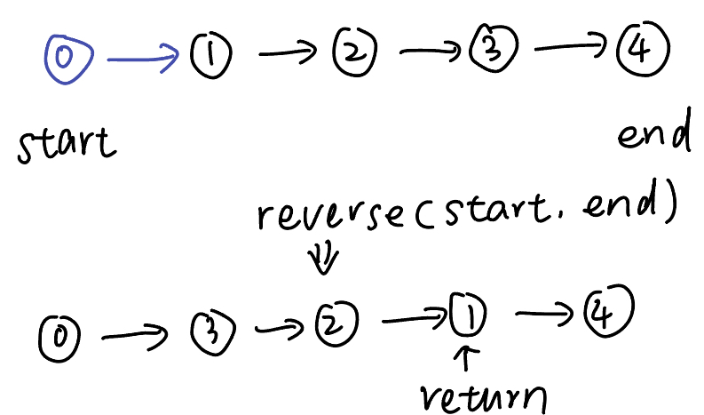

## Basis
``` python
 class ListNode(object):
    def __init__(self, val, next=None):
        self.val = val
        self.next = next
```
* head = [ ]
* only 1 item
* odd and even

## Fast & Slow Pointer
### Template
用来找中点和环
``` python
fast = slow = head
while fast and fast.next:
    fast = fast.next.next
    slow = slow.next
return slow
```
`* -> (*) -> *   or   * -> * -> (*) -> *`
### What I have done
[19. Remove Nth Node From End of List](https://leetcode.com/problems/remove-nth-node-from-end-of-list/description/)  
[24. Swap Nodes in Pairs](https://leetcode.com/problems/swap-nodes-in-pairs/description/)  
[142. Linked List Cycle II](https://leetcode.com/problems/linked-list-cycle-ii/description/)  

## Dummy Head
### Template
``` python
dummy_head = ListNode(next=head)
current = dummy_head
while current.next:

return dummy_head.next
```
### What I have done
[21. Merge Two Sorted List](https://leetcode.com/problems/merge-two-sorted-lists/description/)  
[203. Remove Linked List Elements](https://leetcode.com/problems/remove-linked-list-elements/description/)

## Reverse LinkedList
### Template
reverse nodes between [start + 1, end - 1], return node on (end - 1)  

``` python
def reversek(self, start, end):
    pre, cur = start, start.next
    first = cur
    while cur != end:
        nxt = cur.next
        cur.next = pre
        pre = cur
        cur = nxt
    start.next = pre
    first.next = cur
    return start
```

### What I have done
[25. Reverse Nodes in k-Group](https://leetcode.com/problems/reverse-nodes-in-k-group/description/)

## Merge LinkedList
### Template
``` python
def merge(list1, list2):
    while list2 and list2.next:
        next = list1.next
        list1.next = list2
        list1 = list2
        list2 = next
```
### What I have done
[143. Reordered List](https://leetcode.com/problems/reorder-list/description/)

## Palindrome Linked List
### What I have done
[234. Palindrome Linked List](https://leetcode.com/problems/palindrome-linked-list/description/)

## Other
### What I have done
[23. Merge k Sorted Lists](https://leetcode.com/problems/merge-k-sorted-lists/description/) LinkedList + Heap  
[141. Linked List Cycle](https://leetcode.com/problems/linked-list-cycle/description/)  
[206. Reverse Linked List](https://leetcode.com/problems/reverse-linked-list/description/)  
[707. Design Linked List](https://leetcode.com/problems/design-linked-list/description/)

